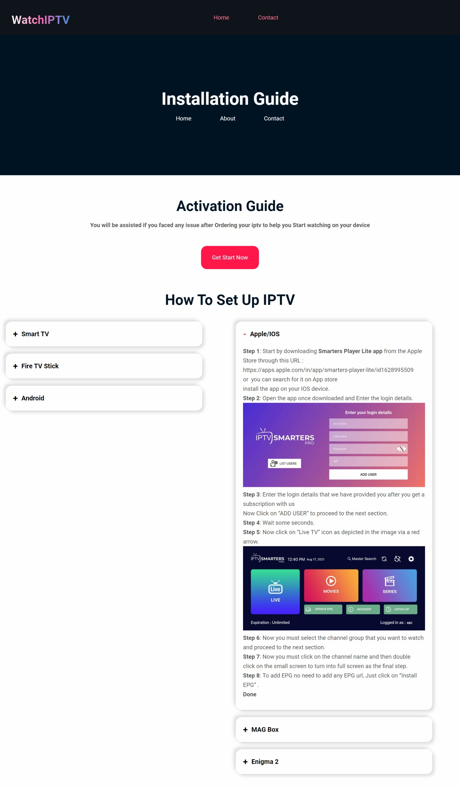

# IPTV Website for Selling TV Packages

Welcome to our IPTV Website! This repository contains the codebase for an advanced IPTV platform designed to sell and manage TV packages. Our goal is to provide a seamless experience for users to subscribe to and enjoy a wide variety of TV channels and on-demand content.

## Table of Contents
1. [Installation](#installation)
2. [Features](#features)


## Installation
Follow these steps to set up the project locally:

1. **Clone the Repository**
   ```bash
   git clone https://github.com/lewis-2000/watchiptv.git
   cd iptv-website


## Features
- **Wide Range of Packages**: Choose from a variety of TV packages catering to different interests and budgets.
- **On-Demand Content**: Access a library of movies, shows, and special events anytime.
- **High-Quality Streaming**: Enjoy buffer-free streaming with high-definition video quality.
- **User Account Management**: Easily manage subscriptions, billing, and personal preferences.
- **Secure Payments**: Multiple payment methods with secure transactions.





